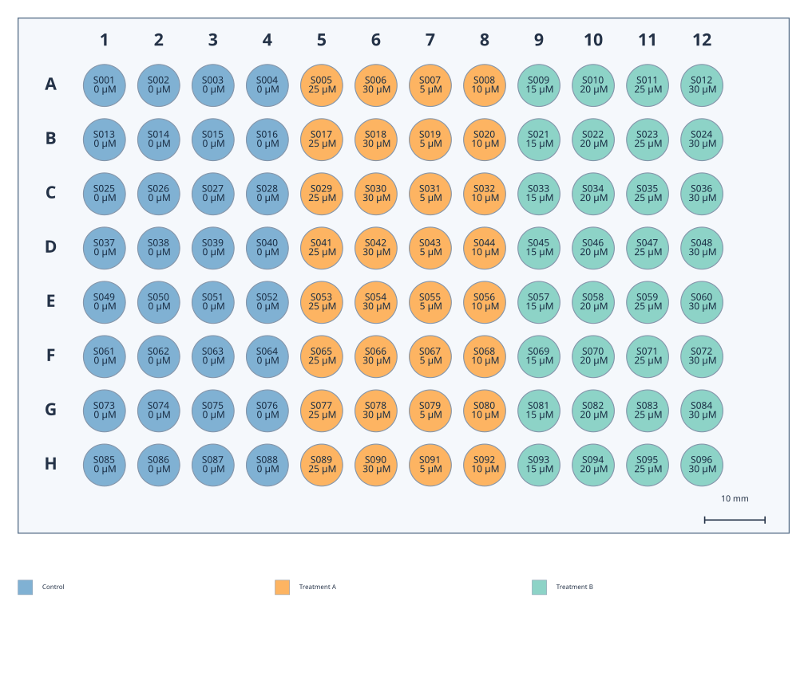

# PlatePlot

用 Python 绘制可配置的孔板示意图，输出可编辑的 **SVG** 和用于打印、排版的
**矢量 PDF**。支持 **12 / 24 / 48 / 96 / 384 孔板**，每孔可显示样品名称、浓度、
自定义文字，并按分组、浓度或手动颜色填色。



## 安装与快速使用

需要 Python 3.10 或以上。初始 PR 合并前，使用实现分支：

```bash
git clone --branch codex/initial-implementation https://github.com/uugxm/plateplot.git
cd plateplot
python -m venv .venv
source .venv/bin/activate
python -m pip install .

plateplot draw --template 96 --data examples/samples-96.csv --output output/plate.svg
plateplot draw --template 96 --data examples/samples-96.csv --output output/plate.pdf
```

Windows 激活虚拟环境使用 `.venv\Scripts\activate`。
仓库当前版本为 `0.1.0a6`。初始 PR 合并前，默认分支只包含初始化文件。

默认使用 Nunc 167008 96 孔细胞培养板（161093 同尺寸）。画带孔位编号的空板：

```bash
plateplot draw --labels well --color-by none --no-legend --output output/blank.svg
```

Python 也可以省略板型：`draw_plate(output="blank.svg", label_fields=["well"])`。

默认不在图中输出板名、尺寸参数或底部模板说明，并收紧外围留白。
使用 `--show-title` / `--show-parameters` 显示这些信息；Python 参数为
`show_title=True` / `show_parameters=True`。显式传入 `--title` / `title` 会显示自定义标题。
模板来源仍保留在文件元数据和 CLI 提示中；`--dimensions` 可独立显示尺寸标注。

行列编号默认放在板框内，字号为 16 pt。用 `--coordinate-font-size`
调整编号大小，`--coordinate-position outside` 放回框外；Python 参数分别是
`coordinate_font_size` / `coordinate_position`。孔内文字使用独立的 `--font-size`。
框内编号会校验是否超出边缘留白或占用相邻编号位置；过大时提示调整字号或比例。

孔边线默认宽度为 0.85 pt，用 `--well-line-width` / `well_line_width` 调整。
默认在板内右下方显示 **10 mm 标尺**，长度随图中的毫米比例缩放，标签表示板体实际长度。
使用 `--scale-bar-mm 20` / `scale_bar_mm=20` 调整长度，或用 `--no-scale-bar` /
`show_scale_bar=False` 隐藏。标尺会校验底部留白，避免压住孔口或越过外框。

## Python API

```python
from plateplot import draw_plate

result = draw_plate(
    template=96,  # 默认 Nunc 167008；也可用其他板型或自定义 JSON 文件路径
    data="examples/samples-96.csv",  # 也可使用 WellData 或字典的列表
    output="output/plate.svg",
    label_fields=["sample_name", "concentration"],
    color_by="group",
    mode="annotation",
)
print(result.path, result.notices)
```

如果已有 pandas DataFrame，使用 `data=df.to_dict("records")`。
API 导出文件并返回页面尺寸、实际缩放比例、每孔字号以及排版提示，不启动图形窗口。

## 每孔数据

CSV 每孔一行，`well` 必填；其余列可留空。只提供已使用的孔位即可，其余孔仍会绘制。

```csv
well,sample_name,group,concentration,concentration_unit,fill_color,label
A1,Sample-01,Control,0,µM,,
A2,Sample-02,Treatment,5,µM,,
A3,Sample-03,Treatment,10,µM,#FDB462,Custom label
```

- `A01`、`a1` 会统一为 `A1`，统一后重复或超出板型范围的孔位会报错。
- 浓度数值与单位分别保存，显示时合并成 `5 µM`；空浓度保持空白。
- 支持 UTF-8 / UTF-8 BOM，以及带引号的逗号、多行文字。
- 支持额外文字列，例如 `note`，可用 `--labels note` 显示。
- 浓度必须是有限、非负数。浓度填色要求数据使用一致单位；工具不自动换算单位。

生成空白数据表：

```bash
plateplot blank-csv 384 samples.csv
```

## 尺寸模板

**内置 `generic-*` 模板均为示意尺寸，不代表某个厂家或货号。**
CLI 会提示 `Illustrative`，使用 `--show-parameters` 时图底也会标明。
实际尺寸图请使用厂家图纸或实测数据建立模板。
同样孔数的产品，孔径、边缘距离等不一定相同。

已加入常用 **Thermo Scientific Nunc 167008 / 161093** 的厂家尺寸模板：

```bash
plateplot draw --template nunc-167008 --data examples/samples-96.csv --output output/nunc.svg
plateplot draw --template nunc-161093 --output output/nunc-1to1.pdf --mode physical --dimensions
```

两个货号使用同一份尺寸图纸：孔口 6.97 mm、孔底 6.17 mm、孔距 9 mm，
A1 中心距左边 14.3 mm、上边 11.18 mm。上边距由图纸的 **H 行到底边 11.3 mm**
换算而来，未使用上下对称假设。外框圆角/缺角做示意简化，CLI 会提示，
使用 `--show-parameters` 时图底也会显示。
图纸来源、SHA-256、尺寸公差和推导详见 [Nunc 96 孔模板说明](docs/nunc-96.md)。
省略绘图板型、选择数字 `96` 或别名 `cell-culture-96` 均使用 `nunc-167008`。
选择 `nunc-161093` 可记录另一货号；通用 96 孔示意模板需显式选择 `generic-96`。
数字 `12`、`24`、`48`、`384` 仍对应各自通用示意模板。

所有长度统一为 **mm**，左上角为坐标原点，A1 在左上方。模板包含板宽、板高、
孔口直径、A1 中心距左/上板边的距离、横/纵孔中心距和圆角半径。
可另外保存孔底直径；当前俯视图使用孔口直径绘制。

```bash
plateplot templates
plateplot export-template 96 my-plate.json
# 编辑 my-plate.json 的尺寸、厂家、货号、source 等字段
plateplot draw --template my-plate.json --output output/my-plate.svg
```

模板校验包括单位、正数、有限数、孔间重叠及孔是否越过外框。
模板来源支持 `illustrative` / `manufacturer` / `measured`，保存 URL、核验日期和说明。
来源分类是录入者的声明，程序不能替代对图纸或实测结果的核验。
详见 [模板字段说明](docs/templates.md)。

## 填色与文字

```bash
# 浓度色阶与矢量色条
plateplot draw --template 96 --data examples/samples-96.csv \
  --color-by concentration --output output/concentration.svg

# 手动颜色；也可 --color-by none 关闭全部填色
plateplot draw --template 96 --data examples/samples-96.csv \
  --color-by fill_color --labels label --output output/manual.svg

# 384 孔只显示短样品编号
plateplot draw --template 384 --data examples/samples-384.csv \
  --labels sample_name --output output/384.svg
```

分组颜色按组名排序分配，输入行顺序不改变颜色。跨实验需要固定颜色时，用
`--palette palette.json`，文件内容为 `{"Control": "#D9D9D9", "Treatment": "#80B1D3"}`。
超过 8 个分组时必须显式指定各组颜色。手动 `fill_color` 优先于自动分组/浓度填色，
图例会显示实际使用的分组颜色或手动颜色。

标签会按实际字体测量自动换行、缩小字号。仍无法容纳时默认报错，建议增加
`--scale`、减少 `--labels` 字段或使用短编号。`--overflow warn` 会警告并省略整个
无法容纳的标签，不会截断浓度或样品名。低于 6 pt 的文字会出现在提示中。

## 物理尺寸与字体

- `annotation`：默认整体放大 2 倍，384 孔放大 3 倍，可指定 `--scale`。
- `physical`：固定 1:1；加 `--dimensions` 显示外框尺寸。
  PDF 页面按选项包含行列号、图例或标题，板子本身按模板毫米尺寸绘制。
- SVG 明确设置毫米页面尺寸；PDF 明确设置物理页面尺寸。打印时选择 **实际大小 / 100%**，
  关闭“适应页面”。
- 当前支持圆孔和圆角矩形外框的俯视示意；厂家定位缺角、筋条、孔壁及三维结构不在第一版中。
- SVG 默认保留可编辑文字，跨设备需安装相应字体。`--svg-text path` 把文字转为矢量路径。
  PDF 嵌入字体子集。字体和标注不使用位图；连续色条由矢量矩形组成。

程序优先使用系统中可用的中英文字体。Linux 如需中文，请安装 Noto Sans CJK 或指定
`--font-file /path/to/font.ttf`；Python 参数是 `font_path`。发现缺字会报错并指出字符。

## 示例与开发

所有示例数据都是虚构数据，可直接运行并复现：

```bash
python -m pip install -e '.[dev]'
python examples/generate.py
pytest -q
ruff check .
ruff format --check .
python -m build
```

示例包括四种通用板型、默认 Nunc 96 孔板、带孔位编号的空板、96 孔 PDF、
1:1 SVG、浓度填色 SVG，以及两款 Nunc 厂家模板。
测试核对输出文件中的几何尺寸、孔位数、SVG 文字/路径选项、矢量输出、CSV 校验和 CLI。
CI 在 Python 3.10 / 3.12 上运行。

许可证：[MIT](LICENSE)。
